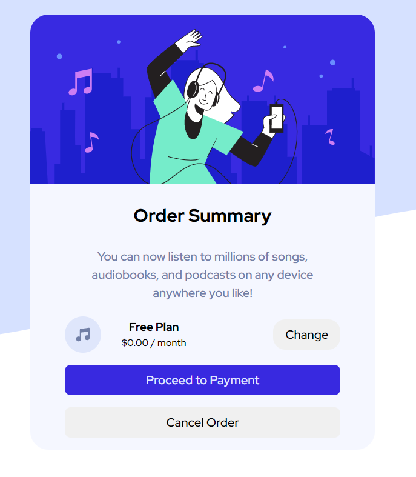
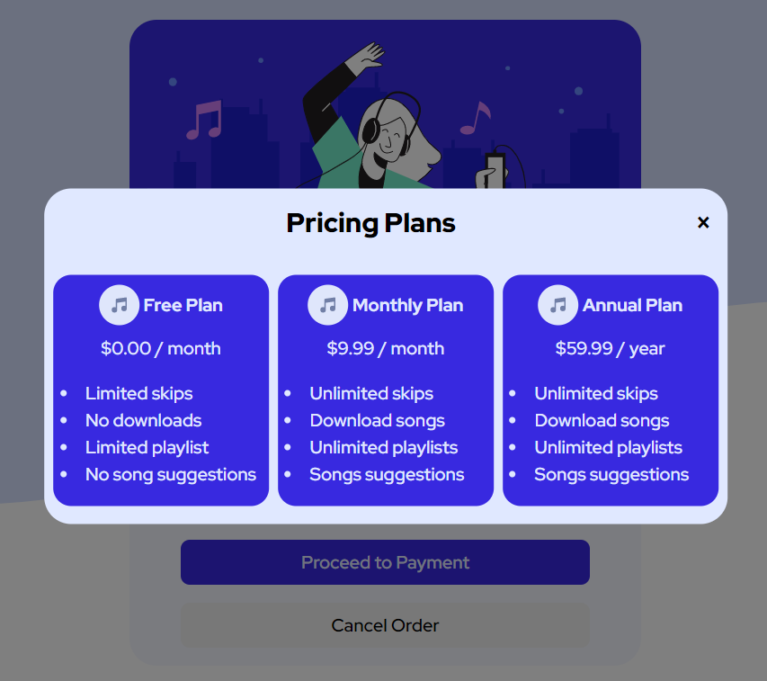

# Frontend Mentor - Order summary card solution

This is a solution to the [Order summary card challenge on Frontend Mentor](https://www.frontendmentor.io/challenges/order-summary-component-QlPmajDUj). Frontend Mentor challenges help you improve your coding skills by building realistic projects. 

## Table of contents

- [Overview](#overview)
  - [The challenge](#the-challenge)
  - [Screenshot](#screenshot)
  - [Links](#links)
- [My process](#my-process)
  - [Built with](#built-with)
  - [What I learned](#what-i-learned)
  - [Continued development](#continued-development)
  - [Useful resources](#useful-resources)
- [Author](#author)

## Overview

### The challenge

Users should be able to:

- See hover states for interactive elements. 

### Screenshot



### Links

- Solution URL: [Add solution URL here](https://your-solution-url.com)
- Live Site URL: [Add live site URL here](https://your-live-site-url.com)

## My process

### Built with

- Semantic HTML5 markup
- CSS custom properties
- Flexbox
- CSS Grid
- Mobile-first workflow
- JavaScript

### What I learned

I used this challenge to create a clickable modal to change the plan for the order summary and to update the html accordingly.

```html
<div class="modal" id="modal">
  <div class="modal-header">
  <h2>Pricing Plans</h2>
  <button data-close-btn class="close-btn">&times;</button>
</div>
```
```css
.modal {
    display: grid;
    width: 40%;
    background-color: var(--primary-pale-blue);
    position: fixed;
    top: 50%;
    left: 50%;
    transform: translate(-50%, -50%) scale(0);
    transition: 200ms ease-in-out;
    border-radius: 1.5em;
    z-index: 10;
}

.modal.active {
    transform: translate(-50%, -50%) scale(1);
}
```
```js
openModalButtons.forEach(button => {
    button.addEventListener('click', () => {
        const modal = document.querySelector(button.dataset.modalTarget);
        openModal(modal);
    })
})

closeModalButtons.forEach(button => {
    button.addEventListener('click', () => {
        const modal = button.closest('.modal')
        closeModal(modal);
    })
})
```

### Continued development

My confidence in Javascript and interactivity on websites are growing but need to give more attention to this.

### Useful resources

- [Web dev simplified](https://www.youtube.com/@WebDevSimplified) - Helped me with the modal creation


## Author

- Frontend Mentor - [@Okkie14](https://www.frontendmentor.io/profile/Okkie14)
